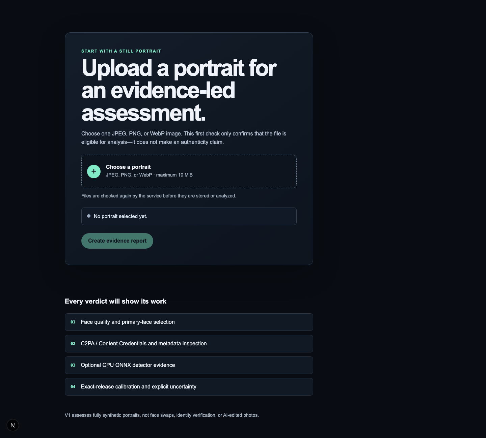
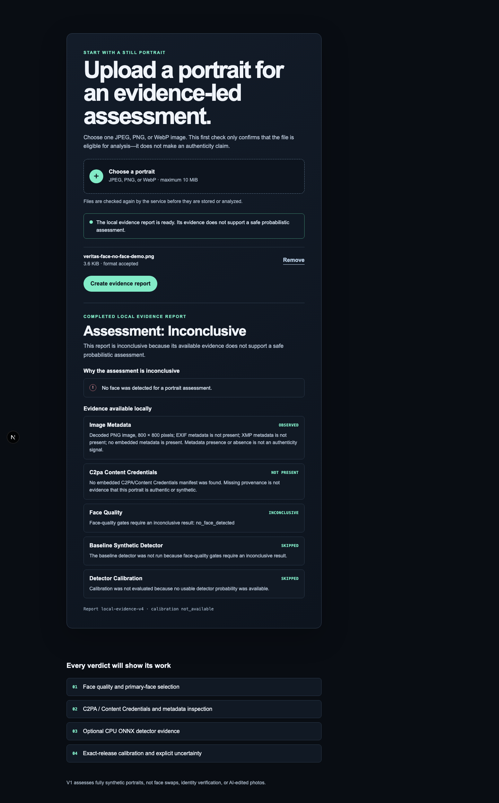
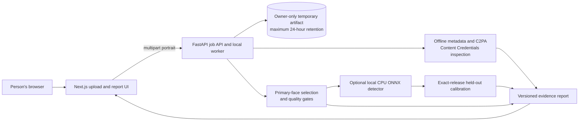

# Veritas Face

**Synthetic Portrait Authenticity Analyzer** — an evidence-first local system
for assessing whether a still portrait resembles a camera-origin or fully
AI-generated image.

> Veritas Face reports probabilistic evidence, not proof. Only validated content
> provenance can verify a declared origin.



## What is available today

The repository provides a complete, tested local evidence-report workflow:

1. The browser accepts one JPEG, PNG, or WebP image up to 10 MiB.
2. The API independently validates and temporarily stores it under a generated
   ID, then selects and quality-checks one dominant face.
3. It records safe metadata-presence facts and verifies embedded C2PA/Content
   Credentials without remote manifest retrieval.
4. An explicitly configured CPU ONNX service may add detector evidence. An
   exact-release, held-out calibration artifact is required before a detector
   score can affect a verdict.
5. The browser receives a versioned evidence report with a
   `likely_synthetic`, `likely_authentic`, or `inconclusive` assessment.

The default checkout has no model weights or calibration artifact, so it
deliberately produces an `inconclusive` report rather than presenting an
unvalidated score as an authenticity claim. There is not yet a public hosted
demo; deployment needs an approved hosting account and an audited private
release bundle. See [TODO.md](TODO.md) for the remaining delivery work.

## Demo

The committed screenshots use no portrait data. The report below comes from a
locally generated non-portrait PNG and demonstrates the intended fail-safe
behavior: no detected face means no detector score and an `inconclusive`
assessment.



Read [the demo notes](docs/demo.md) for the capture conditions and how to
reproduce this path. Do not use a report for identity verification, moderation,
employment, lending, law enforcement, or another consequential decision.

## Architecture



The browser never receives uploaded bytes, client filenames, embedded metadata
values, C2PA manifest contents, signer identities, or facial embeddings. The
local object-store, Redis, Postgres, and inference containers are internal to
the Compose network. For boundaries, data flow, and the intentionally safe
model-unavailable state, see [the architecture guide](docs/architecture.md).

## Run locally

The fastest route is Docker Compose:

```sh
cp .env.example .env
docker compose up --build
```

Open <http://localhost:3000>; API readiness is at
<http://localhost:8000/readyz>. Tear down local containers and volumes when
finished:

```sh
docker compose down -v
```

Docker Compose is for local development, not a public deployment. The full
setup guide includes a no-Docker web/API workflow, configuration boundaries,
and troubleshooting: [docs/setup.md](docs/setup.md).

## Verify a checkout

Install the documented local prerequisites (Node.js 20+, Python 3.11+, and
CMake 3.25+), install dependencies, then run the root quality gate:

```sh
python3 -m pip install -e "services/api[test]"
python3 -m pip install -r services/inference/test-requirements.txt
npm ci
npm run check
```

The root gate validates JavaScript manifests and Compose, runs API, training,
and C++ inference-contract tests, then tests, lints, and builds the web app.

## Project map

- `apps/web` — accessible Next.js upload and evidence-report experience.
- `services/api` — validated intake, temporary job orchestration, provenance,
  quality gates, calibration, and report assembly.
- `services/inference` — C++/CMake CPU ONNX Runtime service.
- `training` — reproducible fine-tuning, release, benchmarking, and aggregate
  evaluation tooling; it contains no portraits, weights, or private results.
- `docs` — system contracts, operations, privacy boundaries, and limitations.

## Evidence and safety boundaries

- V1 is limited to still images with one dominant human face and the narrow
  question of fully synthetic portrait resemblance.
- It does not claim to detect face swaps, identity deepfakes, or every AI edit.
- Low-quality images, multiple ambiguous faces, no face, unsupported media,
  detector failure, calibration mismatch, and meaningful detector disagreement
  return `inconclusive`.
- Metadata or Content Credentials that are absent, invalid, or unavailable are
  never evidence that a portrait is authentic or synthetic.
- Upload artifacts are private, use generated IDs instead of filenames, and are
  deleted with their reports at expiry. The default maximum retention is 24
  hours.

Read the [guardrails](docs/guardrails.md), [face-quality policy](docs/face-quality.md),
and [API contract](docs/api-contract.md) before using the system. Training data
governance, model-release controls, and held-out evaluation publication are
documented in [docs/training-data.md](docs/training-data.md),
[docs/model-release.md](docs/model-release.md), and
[docs/evaluation-publication.md](docs/evaluation-publication.md).
