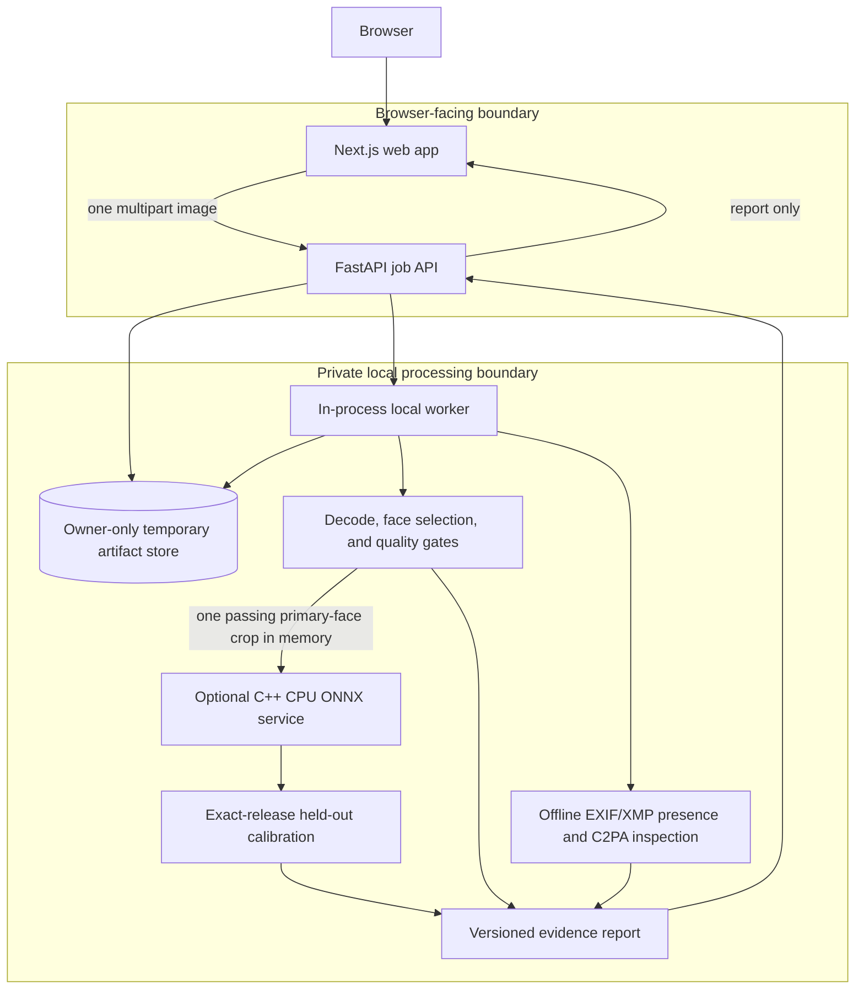

# Architecture and trust boundaries

Veritas Face is a local, evidence-reporting workflow. It accepts a still image,
applies conservative eligibility checks, and reports the evidence that was
available. It is not an origin-verification service and it does not turn a
missing signal into evidence of authenticity.

## Decision flow

1. The web client checks file type and size for usability. The API repeats
   decoding and media validation before it creates a private artifact; browser
   content type is only a hint.
2. The worker decodes the image, selects one dominant face, and applies quality
   gates. No face, multiple ambiguous faces, or insufficient image quality end
   in an `inconclusive` report.
3. It records only safe decoded-image facts, such as format, dimensions, and
   whether EXIF/XMP exists. It verifies embedded C2PA/Content Credentials
   locally; it does not fetch remote manifest stores.
4. For a quality-passing primary face only, the API can call a configured local
   C++ ONNX service. The crop is formed in memory and is not retained in the
   report or service.
5. A detector probability is eligible for a final `likely_*` assessment only
   when a bounded calibration file names that exact detector identifier and
   version. Otherwise it remains unavailable or raw evidence and the report is
   `inconclusive`.
6. The report includes statuses, reasons, model/report versions, and calibration
   version. It deliberately omits image bytes and sensitive metadata.

## What crosses each boundary

| Boundary | Allowed data | Deliberately excluded |
| --- | --- | --- |
| Browser → API | One bounded JPEG, PNG, or WebP upload | A trust claim based on browser MIME type or filename |
| API → temporary store | Generated-ID encoded bytes for the retention period | Client filename, public object URL, durable historical archive |
| Worker → inference | In-memory, standardized primary-face crop after quality passes | Original upload, facial embedding, crop persistence |
| API → browser | Job state and safe, versioned evidence report | Image/crop bytes, artifact path, embedded metadata values, C2PA content, signer identity |

The Compose stack also starts Redis, Postgres, and MinIO to reflect the
intended local topology. In v1 the job store and worker are single-process;
jobs are not durable in Redis or Postgres, and uploaded images are not sent to
MinIO. See [the Compose guide](docker-compose.md) for the exact local service
boundaries.

## Safe defaults

The repository does not contain a model or calibration artifact. A healthy
inference process without `--model` is intentionally model-unavailable. A
detector score without exact-release calibration cannot determine a verdict.
These are safety controls, not deployment errors. The report remains usable as
an explanation of what was and was not available, but it returns
`inconclusive`.

For endpoint shapes and status details, use the [API contract](api-contract.md).
For scope limits and prohibited uses, use the [guardrails](guardrails.md).
